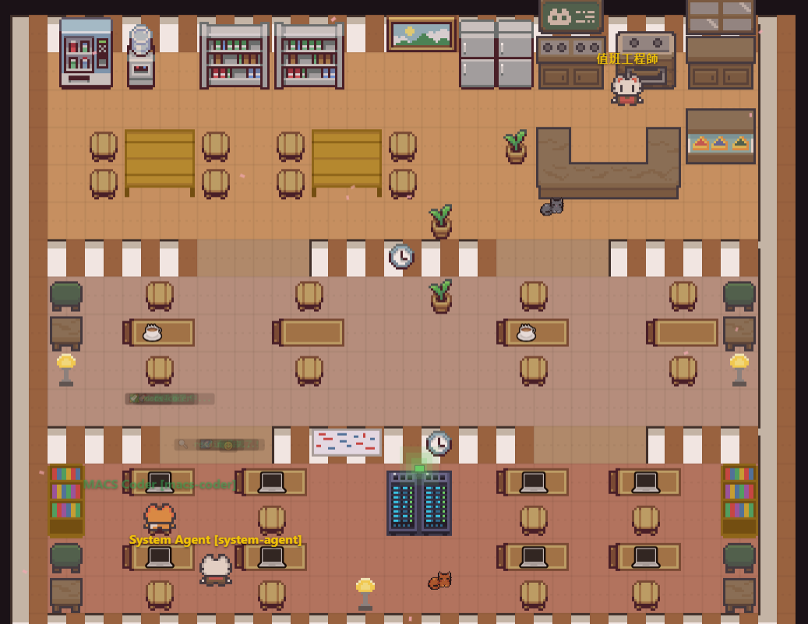
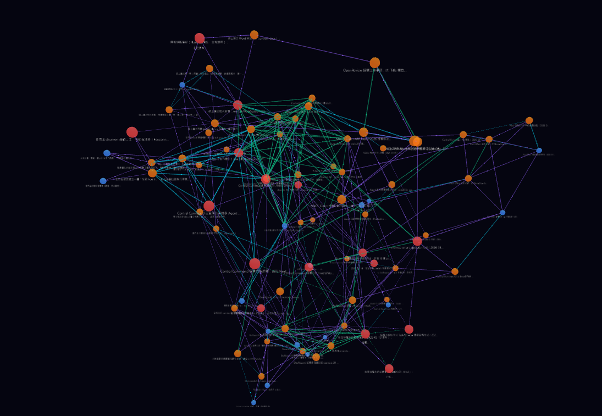

# Agentic Me — Personal AI Agent Collaboration System

A multi-agent orchestration system built on Claude Code. Manage, monitor, and coordinate multiple AI agents through a central dashboard with real-time status tracking, task management, and a pixel-art virtual office.

<div align="center">
  
  <p><em>Pixel Office — Your AI agents working together in a cozy virtual office</em></p>
</div>

```
 ┌──────────────────────────────────────────┐
 │      Dashboard (Next.js, port 3000)      │
 │  Overview │ Projects │ Tasks │ Memory    │
 │  Pixel Office │ Logs │ Schedules         │
 └──────────────────┬───────────────────────┘
               WebSocket + REST
 ┌──────────────────┴───────────────────────┐
 │    Central Server (Hono, port 4000)      │
 │  SQLite │ memcp │ WS (port 4001)         │
 └──────────────────┬───────────────────────┘
                    │
     ┌──────────────┼──────────────┐
     │              │              │
 ┌───┴────┐  ┌─────┴────┐  ┌─────┴────┐
 │Research│  │  Code    │  │  System  │ ...
 │ Agent  │  │  Agent   │  │  Agent   │
 └────────┘  └──────────┘  └──────────┘
```

---

## Features

- **Pixel Office** — Interactive pixel-art virtual office where each agent is visualized as a cat character, with day/night cycle, furniture editor, particle effects, bug ecosystem, and Picture-in-Picture support
- **Central Dashboard** — Real-time overview of all agents, projects, tasks, deadlines, and system health
- **Multi-Agent Orchestration** — Register and coordinate multiple Claude Code agents, each with its own workspace and capabilities
- **Memory System** — Integrated with [memcp](https://github.com/anthropics/memcp) for persistent memory with knowledge graph visualization

<div align="center">
  
  <p><em>Knowledge Graph — Visualizing agent memories, decisions, and their semantic connections</em></p>
</div>
- **Night Shift** — Automated background task scheduling for long-running agent work
- **Discord Bot** — Remote agent control and notifications via Discord bridge
- **PWA Support** — Install as a desktop app with offline capabilities
- **OpenSpec Workflow** — Structured proposal → design → implementation workflow for changes
- **Structured Logging** — Centralized log viewer with filtering

---

## Quick Start

### Prerequisites

- Node.js >= 22
- Claude Code (`npm install -g @anthropic-ai/claude-code`)

### Install & Run

```bash
# Clone
git clone https://github.com/momocat1102/agentic-me.git
cd agentic-me

# Install dependencies
npm install

# Start (Server + Dashboard)
./start.sh
```

After startup:
- Dashboard: http://localhost:3000
- Pixel Office: http://localhost:3000/pixel-office
- Server API: http://localhost:4000/api
- WebSocket: ws://localhost:4001

---

## Dashboard Pages

| Page | Path | Description |
|------|------|-------------|
| Overview | `/` | System stats, agent status, project progress, recent tasks |
| Pixel Office | `/pixel-office` | Interactive virtual office with agent characters |
| Projects | `/projects` | Project progress tracking with OpenSpec integration |
| Tasks | `/tasks` | Task history, filterable by agent |
| Memory | `/memory` | Knowledge graph (Sigma.js) + memory browser |
| Logs | `/logs` | Structured log viewer with level/source filtering |
| Deadlines | `/deadlines` | Deadline management with countdown |
| Schedules | `/schedules` | Night Shift schedule management |

---

## Agent Registration

Agents are registered in `agents.json`:

```json
{
  "agents": [
    {
      "id": "research-agent",
      "name": "Research Agent",
      "role": "Deep search and investigation",
      "path": "/path/to/research-agent"
    }
  ]
}
```

See `agents.json.example` for a full example.

---

## Tech Stack

| Layer | Technology |
|-------|-----------|
| Server | Hono + TypeScript |
| Database | better-sqlite3 |
| Dashboard | Next.js + React + Tailwind CSS 4 |
| Graph Visualization | Sigma.js + Graphology |
| Real-time | WebSocket |
| Memory | memcp (MCP Server) |
| Pixel Office | HTML5 Canvas + custom sprite engine |

---

## Project Structure

```
agentic-me/
├── server/                   # Backend (Hono + TypeScript + SQLite)
│   └── src/
│       ├── index.ts          # Entry point
│       ├── routes/           # REST API routes
│       ├── services/         # Business logic
│       └── discord-bot/      # Discord bridge bot
│
├── dashboard/                # Frontend (Next.js + React + Tailwind)
│   └── src/
│       ├── app/              # Pages (overview, pixel-office, projects, etc.)
│       ├── components/       # Reusable UI components
│       └── lib/
│           ├── api.ts        # API client + WebSocket
│           └── pixel-office/ # Pixel Office game engine
│
├── openspec/                 # Change proposals & specs
├── scripts/                  # Utility scripts
├── docs/                     # Documentation
├── agents.json               # Agent registry
└── start.sh                  # Launch script
```

---

## License

MIT
